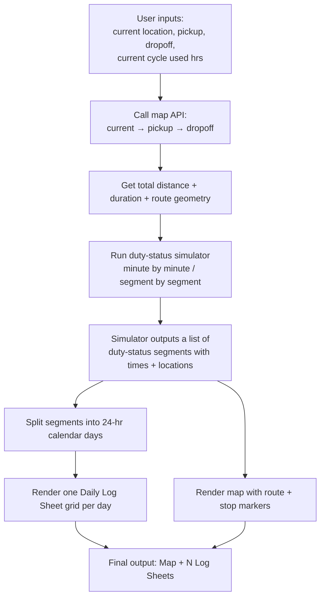
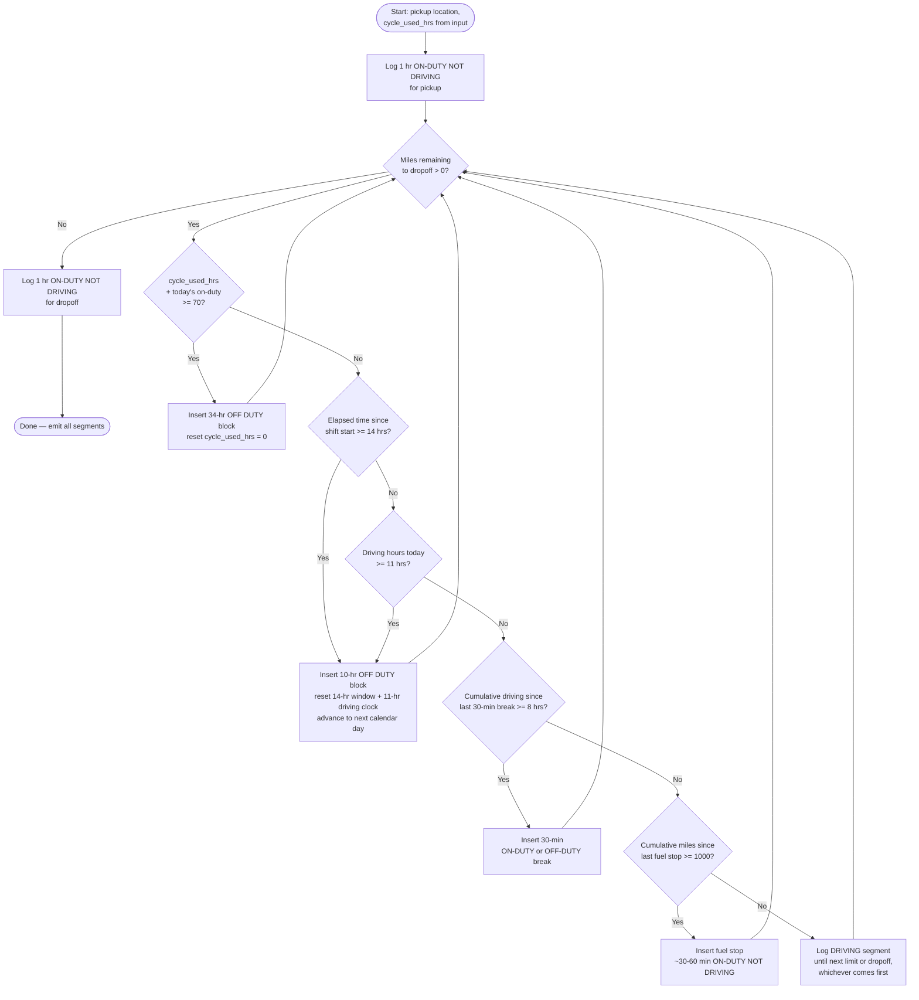
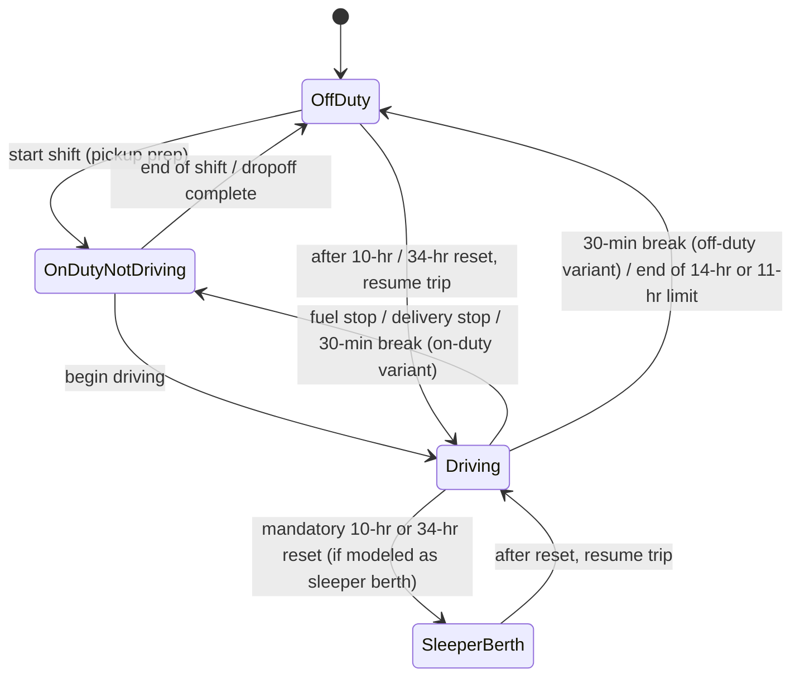
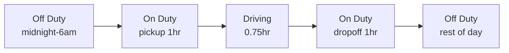
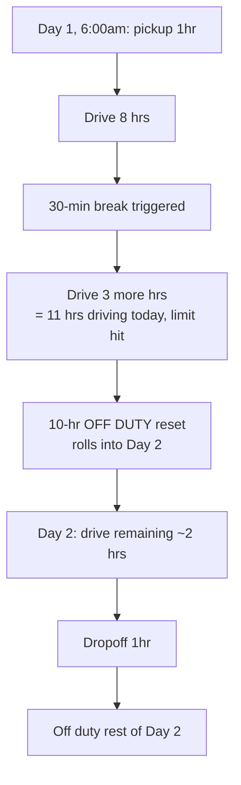
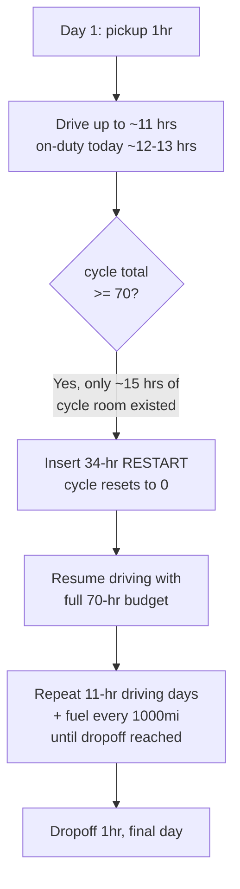
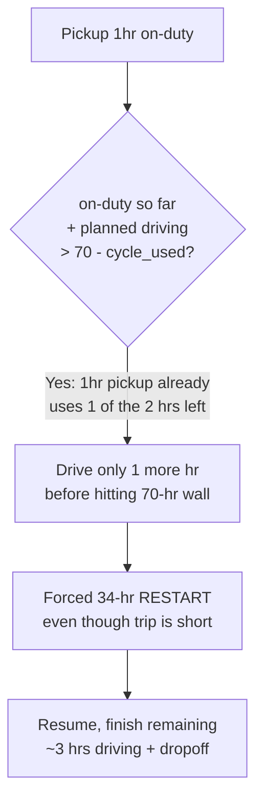

# Trip Planning Algorithm — Visual Guide

Companion to `CLAUDE.md`. This walks the algorithm step by step with flowcharts, then shows several concrete input → output examples so you can see how the rules combine in practice.

## 1. Big Picture

Two outputs come from the **same simulated timeline** — the map just plots the stops, the log sheets draw the same segments as grid lines.

## 2. The Duty-Status Simulator — Decision Loop

This is the core loop. It walks forward in time, accumulating hours, and at each point asks "can I keep driving, or does a rule force a status change?"

**Order of checks matters** — always check the "bigger" limits first (70-hr cycle, then 14-hr window, then 11-hr driving, then 30-min break, then fuel), so you don't e.g. schedule a fuel stop 5 minutes before a mandatory 10-hr reset was already due.

## 3. Duty Status State Machine

At any instant the driver is in exactly one of 4 states. This is what gets drawn as a horizontal line on the log grid.

Note: this app can log the mandatory rest resets as either **Off Duty** or **Sleeper Berth** — either satisfies the 10-hr/34-hr requirement. Off Duty is simpler to implement and matches the assignment's "no sleeper berth splitting" scope from `CLAUDE.md`.

## 4. Worked Examples

### Example A — Short trip, no limits triggered

**Input**: Current = Dallas, TX · Pickup = Dallas, TX · Dropoff = Fort Worth, TX · Cycle used = 10 hrs

- Distance ≈ 35 mi, drive time ≈ 45 min.
- No 1000-mi fuel stop, no 8-hr break, no 11-hr/14-hr/70-hr limit hit.

**Expected output**:
- 1 map with a single short route line, no rest-stop markers.
- **1 Daily Log Sheet**: Off Duty (rest of day) / On-Duty-Not-Driving 2 hrs (1 pickup + 1 dropoff) / Driving 0.75 hrs / totals = 24 hrs.

### Example B — Medium trip, triggers 30-min break only

**Input**: Current = Chicago, IL · Pickup = Chicago, IL · Dropoff = St. Louis, MO · Cycle used = 5 hrs

- Distance ≈ 300 mi, drive time ≈ 5 hrs. Under 8 hrs driving, under 11-hr/14-hr limits, under 1000 mi.
- **No mandatory break needed** in this case (5 hrs < 8-hr break trigger) — trip completes same day.

**Expected output**:
- 1 map, straight route, no rest markers (maybe 1 optional fuel icon if you choose to show fuel below 1000mi — not required here).
- **1 Daily Log Sheet**: On-Duty 2 hrs (pickup+dropoff) + Driving 5 hrs + Off Duty ~17 hrs = 24 hrs.

### Example C — Long trip, triggers 8-hr break + overnight 10-hr reset

**Input**: Current = New York, NY · Pickup = New York, NY · Dropoff = Chicago, IL · Cycle used = 8 hrs

- Distance ≈ 790 mi, drive time ≈ 13 hrs — exceeds 11-hr driving limit AND likely the 14-hr window.

**Expected output**:
- 1 map with route + 1 rest-stop marker (overnight) + 1 break marker (30-min).
- **2 Daily Log Sheets** (Day 1 and Day 2), each summing to 24 hrs, with Remarks showing city/state at each status change (start, break location, overnight stop, dropoff).

### Example D — Very long trip, triggers 34-hr restart

**Input**: Current = Los Angeles, CA · Pickup = Los Angeles, CA · Dropoff = New York, NY · Cycle used = 55 hrs

- Distance ≈ 2,780 mi, drive time ≈ 42 hrs of pure driving. At 11 hrs/day max, that's 4+ driving days — but cycle_used starts at 55, so the 70-hr limit (only 15 hrs of cycle room left) is hit almost immediately.

**Expected output**:
- 1 map, route + several stop markers: fuel stops (every ~1000 mi, so ~2-3 for this trip), overnight 10-hr resets, and 1 highlighted 34-hr restart block.
- **~5-6 Daily Log Sheets** (one per 24-hr period spanned), one of which will show a mostly-blank grid (all Off Duty) for the 34-hr restart day(s), since >24 consecutive off-duty hours can span into a second log page per the "multiple consecutive days off duty may be combined" rule in `CLAUDE.md`.

### Example E — Cycle already nearly maxed out

**Input**: Current = Miami, FL · Pickup = Miami, FL · Dropoff = Orlando, FL · Cycle used = 68 hrs

- Distance ≈ 235 mi, drive time ≈ 4 hrs — trivially short trip, BUT only 2 hrs of cycle room remain (70 - 68).

**Expected output**: this is the trickiest case to get right — a *short* trip can still require a 34-hr restart purely because the input `cycle_used_hrs` was already close to 70. Good test case to sanity-check your simulator against.

## 5. Summary Table — Which Rule Triggers What

| Condition checked | Threshold | What happens | Log grid effect |
|---|---|---|---|
| Cumulative driving since last break | ≥ 8 hrs | Insert 30-min break | Short gap in Driving row, filled by Off Duty or On-Duty-Not-Driving |
| Driving hours today | ≥ 11 hrs | Force 10-hr off-duty reset | Driving row stops; Off Duty row starts; new log page begins next day |
| Elapsed time since shift start | ≥ 14 hrs | Force 10-hr off-duty reset (even if driving hrs < 11) | Same as above |
| Cumulative miles since last fuel | ≥ 1000 mi | Insert fuel stop (~30-60 min) | Short gap in Driving row → On Duty (Not Driving) |
| Rolling 8-day on-duty total (cycle_used + accrued) | ≥ 70 hrs | Force 34-hr restart | Large Off Duty block, likely spanning 1-2 full log pages |
| Trip complete (reached dropoff) | — | Log 1-hr dropoff, then Off Duty | Final segment of last log page |

## 6. What Gets Output, Concretely

For **every** trip, regardless of length:
1. **Map**: polyline route (current→pickup→dropoff), markers for pickup, dropoff, every fuel stop, every mandatory rest stop, labeled with city/state (matches the Remarks convention in `CLAUDE.md`).
2. **N Daily Log Sheets**, `N = number of calendar days the trip's timeline spans`, each with:
   - Header fields filled in (date, miles driven that day, carrier info — can be placeholder/mock values since the assignment doesn't require real carrier data entry)
   - Grid drawn with the 4 duty-status lines matching the simulated segments for that day
   - Remarks listing city/state at each status change
   - Recap box hours (on-duty today, 7/8-day rolling totals) computed from the simulator state at that point
